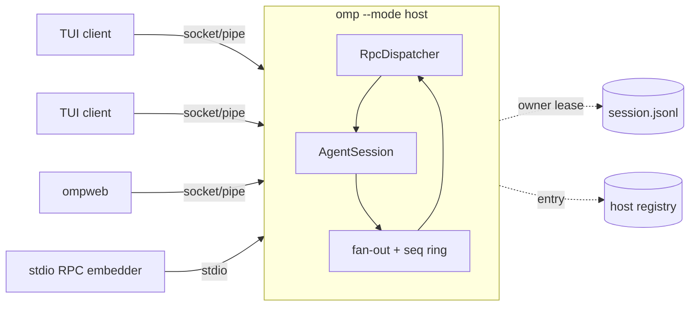

# Session host: TUI as a multiplexed RPC client

Status: design approved in conversation 2026-10-01. Base: `upstream/main` @ `2399a84091`.

## Goal

Run each live omp session in a long-lived **host process** that is independent of any UI. Terminals and ompweb attach to it as **clients**: several at once, detaching and re-attaching at will. Sharing is for **one person in several places** (follow the work, resume it, rejoin from another terminal or ompweb), not for co-working.

## Decisions

| # | Decision |
|---|---|
| D1 | One protocol: the existing RPC command and event grammar, extended with attach, snapshot, `seq`, and `session_replaced`. The collab wire is not reused. |
| D2 | Multiplexing lives in the host. The host serves N RPC connections directly. No external mux. |
| D3 | Transport: `node:net` on every platform. Unix socket on POSIX, named pipe `\\.\pipe\omp-host-<key>` on Windows, following the existing `collab/registry.ts` and `launch/paths.ts` convention. A bearer token is mandatory on every platform. Local machine only; cross-machine sharing stays with collab. |
| D4 | One host process per session (no multi-session daemon). |
| D5 | All attached clients are equal: any client may prompt, abort, steer, or change model and settings. A mid-turn prompt follows the existing steer and follow-up rules. |
| D6 | The host switches sessions and every client follows (`/new`, `/resume`, `/fork`, `/tree`). Client-only moves use `/attach`, `/new --solo`, and `/fork --solo`. |
| D7 | Lifetime: `/detach` leaves the host running. `/exit` acts as `/detach` while other clients remain; from the last client it stops the host. A dropped or killed client counts as `/detach`. There is no idle timeout. |
| D8 | Opt-in via the setting `tui.hosted` (default `false`). P4 flips the default, then the setting and the in-process interactive path are removed. There is no `--host` flag. |
| D9 | Only the host opens the session file for write. Clients never construct a file-backed `SessionManager` for it, so the ownership lease never forks it. |
| D10 | Write ordering: the host executes commands serially, so transport order is already total. Stale-view writes are guarded by optional preconditions `ifEpoch` and `ifLeaf`, not by a global counter: `seq` advances on every streamed frame, so a global counter would reject nearly every write during a turn. |

## Architecture

### Units

| Unit | Responsibility | Source |
|---|---|---|
| `RpcConnection` | One client's state: frame codec (v2 chunking), writer with backpressure, event filter, pending extension-UI, host-tool, and host-URI maps, declared capabilities | Extracted from module-level state in `modes/rpc/rpc-mode.ts` |
| `RpcDispatcher` | Executes an `RpcCommand` against one `AgentSession` on behalf of a given connection | The existing command switch in `rpc-mode.ts`, made connection-aware |
| `SessionHost` | Owns the `AgentSession` and its connections. Assigns `seq`, keeps the replay ring, fans out frames, arbitrates first-answer-wins UI, enforces D7 | New |
| Stdio transport | Exactly one connection. EOF keeps today's behavior: dispose and exit | Existing `rpc-input.ts` and `RpcOutputWriter` |
| Socket/pipe listener | N connections, token-authenticated `hello` | New, using the `node:net` convention from D3 |
| Host registry | Owner-only JSON per host `{hostId, pid, endpoint, token, cwd, sessionFile, title, startedAt}` in the per-user agent dir | `collab/registry.ts` pattern, including socket path-length fallback |
| `omp --mode host` | Headless detached host entry point | New mode in `main.ts` |
| `HostedClientLink` | Client-side link that owns an `RpcClient` over `connectSessionHost`, applies the host's snapshot, `entry`, event, and dialog frames to the idle local replica session the TUI renders, and sends input to the host over RPC. Replaces the planned `RemoteSession` object: the TUI keeps a local passive `AgentSession` and reads host state through the link | `session-host/hosted-client.ts`, built on `RpcClient` with a socket transport |
| Replica `SessionManager` | Client-local mirror of the session tree for transcript and tree views, seeded by the snapshot and fed by `entry` frames. It lives in an owner-private replica file (directory `0700`, file `0600`) with a unique name per client and snapshot, outside the sessions listing. On leaving, the client deletes its own files once in-flight frame application has settled. A client that dies without running that path (`SIGKILL`, an out-of-memory kill, power loss) leaves its files behind: nothing sweeps the directory, so they are removed by hand. A client pid in the file name, with dead ones dropped on the next connect, would automate it; P2 does not build that | Collab-guest replica mechanics, shared in `session/replica-view.ts` |

### Invariants

1. `--mode rpc` over stdio is byte-for-byte compatible. All new frames are opt-in and appear only after `hello` on socket transports.
2. The host claims the owner lease before opening its listener, and writes its registry entry before starting extensions. A registry entry therefore implies a reachable host that owns its file. Extension startup runs after that, so a client can answer a dialog `session_start` awaits; until startup ends the host handles only dialog answers and `set_ask_dialog`, and every other frame waits.
3. Snapshot construction and connection registration happen in the same tick, so no frame can fall between them.

## Protocol additions

### Handshake (socket/pipe only)

1. Client → `hello{token, protocolVersion, client:{kind, label}, capabilities:{ui}, resume?:{hostId, epoch, lastSeq}}`. Host tools are not a hello capability: a client registers them per connection with `set_host_tools`.
2. Host → the existing `ready{…}` frame, then one of:
   - `attached{hostId, clientId, epoch, seq, snapshot}` with `snapshot = {state, entries, streaming?, pendingUi[], clients[]}`;
   - `resumed{epoch, replayed}`, followed by the replayed frames, when `hostId` and `epoch` match and `lastSeq` is still in the ring. Any other `resume` gets `attached`.
3. A bad or missing token → `response{command:"hello", success:false, code:"unauthorized"}`, then close. A socket that sends no `hello` within 10 s is closed without a reply.

`streaming` carries the in-flight assistant message for a mid-turn join. `pendingUi` carries open extension-UI requests so a late joiner can answer them.

### Live frames

- Every broadcast frame (session event, `entry`, `session_replaced`, `clients_changed`, and other session-wide notices) carries a host-wide monotonic `seq`. A connection sees gaps for session events its own `set_event_filter` drops and for extension-UI frames when it did not declare `capabilities.ui`. Frames addressed to one connection (responses, `prompt_result`, host tool/URI requests) and subagent frames carry no `seq`. There is no separate `state` push frame: state changes arrive as session events, and snapshots carry full state. The ring buffer holds the most recent frames. A resume outside the ring receives a fresh `attached` snapshot, never a partial replay.
- `entry{entry}` on every session-file append. This requires the single-handler entry-appended hook in `SessionManager` to accept multiple listeners.
- `session_replaced{epoch, sessionFile, reason:"new"|"resume"|"fork"|"tree", snapshot}` carries the fresh snapshot inline, so no frame can fall between the replacement and its snapshot. `epoch` increments on every replacement, and a resume with a stale epoch receives a snapshot. `tree` covers tree navigation that moves the leaf within the same file: the transcript changes wholesale even though `sessionFile` does not; P1 has no such command, so the host never sends it. `handoff` stays in the same session (it appends a compaction entry) and produces no `session_replaced`. Entries a new session appends can arrive before its `session_replaced`, still at the old epoch; on `session_replaced` a client discards its transcript view and rebuilds it from the inline snapshot.
- `clients_changed{clients[]}` reports presence.

### Arbitration

- `extension_ui_request` goes to every connection that declared `capabilities.ui`. The first `extension_ui_response` wins, and every other UI connection receives the existing `cancel` for that request id. Late responses are ignored.
- With zero UI-capable connections, requests stay pending and appear in the next snapshot. They are never rejected for lack of a client.
- Host tools are registered per connection. A call routes to the connection that registered the tool most recently. If that connection drops mid-call, the call returns a tool error `host tool client disconnected`.

### Write preconditions

- Any mutating command may carry `ifEpoch`. The TUI client always sends it. On mismatch the host returns `error{code:"stale", epoch}` and does not execute the command.
- Tree-mutating commands (`branch`, tree navigation, fork, `/move`) may also carry `ifLeaf`, the leaf entry id the client last saw. On mismatch: `error{code:"stale", leafId}`.
- On `stale` the client never retries silently. It has already received `session_replaced` or the `entry` frames that moved the leaf, so it re-renders and keeps the unsent input in the editor for the user to resend.
- `abort`, `detach`, `exit`, `get_*` reads, and `extension_ui_response` never take a precondition; abort is never rejected.
- Mid-turn prompts follow the existing steer and follow-up rules. Model and settings changes are last-write-wins.
- Both fields are optional, so stdio RPC and existing embedders are unaffected.

### New commands

| Command | Behavior |
|---|---|
| `detach` | The host closes this connection. The session continues. |
| `exit` | `detach` if other connections remain; from the last connection, dispose and exit 0 (exit 1 on a latched persistence failure, as in RPC mode today). |
| `slash_command{text}` | Runs a built-in slash command's headless `handle` (`SlashCommandSpec`) on the host. **Not implemented in P2:** until P3, a client sends `/name args` to the host as the text of an ordinary `prompt`, whose handler already runs a built-in that has a headless `handle`. Clients built against this spec, such as ompweb, must do the same until the command exists. |
| Read commands | Existing RPC reads expose session state (including queued text and goal state), models, entries, tree, and subagents; socket snapshots expose cwd through `origin`. Reads for plan state, job listings, and MCP status belong to their P3 follow-ups. |

`new_session`, `switch_session`, and `branch` act on the host. Switching to a file another host owns returns `error{code:"session_hosted", hostId}`.

## Lifecycle and discovery

### Spawn

Triggered by plain `omp` with `tui.hosted: true`, `omp --resume <session>` with `tui.hosted: true` (attaching instead when a host already owns the session), `omp attach <session>` when no host owns it, `/attach <session>`, and the `--solo` commands.

1. The client spawns `omp --mode host [--session <file> | --new]` detached via `ptree`: own process group, inherited env and cwd, stdio redirected to a host log in the runtime dir.
2. The host claims the lease, opens the listener, then writes its registry entry atomically.
3. The client waits a bounded time for the entry, then connects. On timeout it exits non-zero and prints the host log path. There is no in-process fallback.

### Lookup

- `omp attach` with no argument lists and picks live hosts (title, cwd, session, client count, busy).
- `omp attach <hostId|sessionId|path>` resolves to a host, spawning one if none owns the target session.
- The registry is scanned directly; the host count is small, so there is no index.
- Stale entries (dead pid or refused connect) are deleted by whichever reader finds them.
- A target file leased by a non-host process (an in-process TUI, print mode) → `omp attach` refuses with "open in a non-host process (pid N)".

### Exit paths

| Event | Host |
|---|---|
| `/detach`, socket drop, client crash, client SIGHUP | keeps running |
| `/exit` with other clients attached | treated as `/detach` |
| `/exit` from the last client | disposes the session, removes its registry entry, exits |
| SIGTERM/SIGINT to the host | clean dispose, then exit |
| SIGHUP to the host | ignored |
| Host crash | P2: the client shows "host exited" (or the connection-loss reason) and exits with status 1. Showing the exit code or signal, and offering to reopen the session in a new host, belong to the P3 automatic-reconnect work. The lease died with the host, so the file is reusable. |

Stopping an orphaned host is `omp attach <id>`, then `/exit`.

## TUI client

### Shape

With `tui.hosted: true`, or under `omp attach`, `InteractiveMode` runs against a permanently idle local replica session instead of an in-process `AgentSession`. The replica is a passive `AgentSession` over the replica file above, never the host's session file (D9), and `HostedClientLink` feeds it from the host's snapshot, `entry`, and event frames. User messages render from events only; there is no optimistic echo in client mode.

### Command routing

1. Built-in slash commands with a headless `handle` are sent to the host as the submitted text of a `prompt` (P2). A dedicated `slash_command` command is not implemented; see New commands.
2. `handleTui` commands are triaged once into a parity table:
   - **view-local** (theme, hotkeys, copy, and similar): run in the client unchanged;
   - **session-mutating** (tree, fork, `/move`, settings, MCP, jobs, plan, goal, loop): split into a headless `handle` on the host plus a client-side presenter;
   - **not yet ported**: show "unavailable when attached".
3. Extension UI requests are answered with the existing TUI dialogs (`extension-ui-controller`).
4. Client-machine inputs: clipboard images travel as prompt images, and `!cmd` uses the `bash` RPC command.

### `/btw` parity and ownership

The stdio RPC prerequisite is tracked in [can1357/oh-my-pi#14110](https://github.com/can1357/oh-my-pi/pull/14110): `btw {question, recordId?}`, `btw_cancel {recordId?}`, and `get_btw_history`, with `btw_delta` and `btw_record` frames. Questions run beside the main turn and persist in the existing BTW sidecar, not the transcript. Follow-ups reuse the topic; copy remains client-local.

A parity follow-up (P3) gives the host one BTW lifecycle owner per session, sharing the headless turn helpers with the in-process TUI. For socket clients, route live answer frames to the requesting connection, and notify other clients when persisted history changes. Reconnect restores history; session replacement cancels the old question and flushes its checkpoints. An unsaved terminal checkpoint must stop a session replacement until storage recovers. Until then `/btw` is unavailable when attached.

The same follow-up adapts `BtwController` into a presenter over these commands and events. Branch promotion remains a separate parity requirement: `branchFromBtw` must execute on the host with the original session and leaf guards; the initial stdio RPC PR does not expose promotion. `/btw` cannot become a view-local command or be considered fully ported until that promotion path is covered.

### Client commands

| Command | Effect |
|---|---|
| `/detach` | Disconnect and exit the client; the host keeps running. |
| `/exit` | As in D7. |
| `/attach [host\|session]` | Move this client to another host, spawning one for a session without a host. With no argument, opens a picker. |
| `/new --solo`, `/fork --solo` | Spawn a new host, move this client to it, and run the command there. Other clients stay on the original host. |
| `omp attach [host\|session]` | Shell equivalent of `/attach`. |

### State machines moved to the session or host

Plan mode, goal mode, loop mode and loop auto-submit, the compaction queue, `#pendingModelSwitch`, and the idle-compaction and idle-recap timers in `event-controller`. They must run with zero clients and must run once regardless of client count. The in-process TUI uses the moved implementations as well, so there is a single implementation.

These moves happen in P3, one state machine per follow-up. The P2 client disables every TUI-owned timer and automation path, and the commands that depend on them report "unavailable when attached"; in-process mode is unchanged.

### Stream volume

The P2 client keeps the default `message_update` projection: each frame carries the whole accumulated message and `assistantMessageEvent.partial`, so the bytes sent grow quadratically with the size of a message. A burst probe (a mock stream with no pacing, one 100 KB message in 2000 blocks) produced 6000 `message_update` frames and about 1.8 GB serialized, roughly 18,000 times the payload. Real providers pace their deltas, so steady-state load is lower `[INFERENCE: not measured]`, but large tool-call arguments cost CPU on both ends, a slow or suspended terminal can reach the 64 MiB per-connection spool cap and be dropped as "connection lost", and the 4096-frame replay ring retains the large frames.

P3 adds a delta projection for socket clients, with the accumulation done in the client, and measures the volume again. The default must not flip (P4) before it lands.

### Unavailable in client mode (v1)

- PTY bash overlays need a second stream.
- `custom()` components, `setFooter`, `setHeader`, `setEditorComponent`, and `onTerminalInput` cannot cross a process boundary; extensions using them lose that UI when attached.
- OAuth loopback redirects land on the host machine. That is harmless while transport is local-only.

## Phases

Estimates are `[INFERENCE]` from code reading.

| Phase | Delivers | Estimate |
|---|---|---|
| P1 | `RpcConnection` and `RpcDispatcher` split; socket/pipe transport; `--mode host`; registry; handshake, snapshot, `seq`, ring, `session_replaced`, `clients_changed`; arbitration; `detach` and `exit`; `omp attach` listing. ompweb can switch to it immediately. | 1–2 weeks |
| P2 | Minimal TUI client behind `tui.hosted`, merged in a working state: spawn or connect a host, render from a local replica fed by snapshot and `entry`/event frames, prompt/abort/steer/queue, model and thinking, extension dialogs, headless builtins forwarded to the host as `prompt` text (there is no `slash_command` command until P3), `/detach`, `/exit`, `/attach`, `omp attach <target>`. TUI-owned automation is off in client mode; every other command reports "unavailable when attached". A lost connection ends the client with status 1. | 2–3 weeks |
| P3 | Parity follow-ups, each merged separately: plan, goal, loop, idle compaction and recap move to the session or host; tree and fork; `/btw` host ownership (with can1357/oh-my-pi#14110); extension status/widget/title replay; `--solo`; a delta `message_update` projection with client-side accumulation (see Stream volume); automatic reconnect after an unexpected transport loss, using host identity, epoch, and sequence replay with snapshot fallback, which is also where "offer to reopen the session in a new host" after a host crash lands. Explicit detach/exit never reconnects; uncertain mutating commands are not silently resent. | 1–2 weeks per group |
| P4 | The parity table has no "not yet ported" rows, automatic reconnect is implemented, and the delta projection has landed → default flips. Later, delete the setting and the in-process interactive path. Print mode, ACP, and subagents stay in-process. | about 1 week |

## Error contracts

| Failure | Observable result |
|---|---|
| Host fails to start | Client exits non-zero and prints the host log path |
| Bad or missing token | `error{code:"unauthorized"}`, then close |
| Resume outside the ring or with a stale epoch | Full `attached` snapshot |
| Host dies mid-turn | P2: "host exited" and exit status 1. The offer to reopen in a new host is part of the P3 reconnect work |
| Switch to a hosted file | `session_hosted{hostId}`; the client offers `/attach` |
| Late UI answer | Ignored; that client already received `cancel` |
| Stale `ifEpoch` or `ifLeaf` | `error{code:"stale"}`; command not executed; client keeps the input for resend |
| Host-tool owner disconnects mid-call | Tool error `host tool client disconnected` |
| Latched persistence failure | Broadcast `notice`; the host exits 1 on shutdown |

## Testing

Behavioral tests against a real host process over a real socket or pipe, each with an isolated agent directory.

1. Stdio RPC parity: the existing RPC suite passes unchanged against the refactored dispatcher. This is the P1 regression gate.
2. Fan-out: two clients attach; a prompt from A produces identical, `seq`-ordered events and entries on both.
3. Late join mid-turn: the snapshot includes the partial message and the open approval. The late client answers it, and the other client receives `cancel`.
4. Resume: reconnect with an in-ring `lastSeq` → replay with no gaps or duplicates; an expired `lastSeq` → snapshot.
5. Lifetime: `/detach` from the last client leaves the host running. `/exit` with two clients leaves it running. `/exit` from the last client stops it and removes the registry entry. SIGKILL of a client counts as detach.
6. Switching: `new_session` from A → B receives `session_replaced` with a new epoch. Switching to a file another host owns → `session_hosted`.
7. Windows: the same suite over named pipes on the win32 CI runner.
8. Smoke: `omp --smoke-test` adds a spawn → attach → ping → exit host probe, so binary, tarball, and source installs exercise the detached spawn path.
9. Preconditions: B switches session, then A prompts with the old `ifEpoch` → `stale`, and nothing is appended to either session. B branches, then A forks with the old `ifLeaf` → `stale`. `abort` with an old epoch still aborts.

## Out of scope

- Multi-session daemon (one process hosting many sessions). It would first need `setProjectDir` → `process.chdir`, the `settings` proxy, `AgentRegistry.global()`, and the `MCPManager` and `AsyncJobManager` singletons fixed.
- Cross-machine attach. Collab covers it.
- Replacing or extending the terminal-relay attach PR can1357/oh-my-pi#8408.
